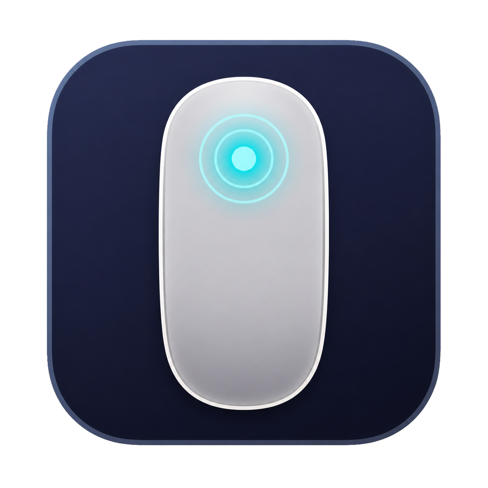

# Mouse Toucher

<p align="right"><a href="README.zh-CN.md">简体中文</a> · English · <a href="https://github.com/wudongchen/MouseToucher">GitHub</a></p>

<p align="center">
  
</p>

**Tap-to-click for Apple Magic Mouse.**

Mouse Toucher adds trackpad-style touch clicking to Magic Mouse. Tap the surface instead of pressing the physical button.

## Features

- Tap the left side for a left click
- Tap the right side for a right click
- Single-click and double-click support
- Movement filtering to reduce accidental clicks while scrolling
- Enable or disable tap-to-click from the menu bar
- Adjustable right-click boundary (40%–90%)
- Connection status shown in the menu bar menu
- Automatically re-registers the mouse after Bluetooth reconnects or macOS wakes
- English and Simplified Chinese menu text
- Runs locally without network access or data collection

## Requirements

- macOS 11.0 (Big Sur) or later
- Apple Magic Mouse (1st or 2nd generation)
- A Bluetooth-connected Magic Mouse
- Accessibility permission (required to synthesize click events)

## Installation

### Build from source

```bash
git clone https://github.com/wudongchen/MouseToucher.git
cd MouseToucher
./build.sh
ditto build/MouseToucher.app /Applications/MouseToucher.app
open /Applications/MouseToucher.app
```

The build script creates a universal arm64/x86_64 app and ad-hoc signs it with a stable designated requirement so Accessibility permission can survive local rebuilds.

### Grant Accessibility permission

1. Open Mouse Toucher.
2. In the permission dialog, choose **Open System Settings**.
3. Go to **Privacy & Security → Accessibility** and enable Mouse Toucher.
4. Return to the app. It will begin working automatically.

Because the app uses Apple's private `MultitouchSupport` framework, macOS may show an “app is damaged” or unidentified-developer warning. Open it from Finder once, then choose **Open**; you can also allow it under **Privacy & Security**.

## Usage

Click the mouse icon in the menu bar:

- **Magic Mouse: Connected/Disconnected** — read-only connection state
- **Tap to Click** — turn touch clicking on or off
- **Right Click Zone** — choose where the right-click area starts
- **Accessibility Instructions** — reopen the permission instructions
- **Language** — switch between English and 简体中文
- **About** — view version and framework information

Keep taps short and light. Moving your finger across the surface is treated as scrolling rather than a click.

## Troubleshooting

### Taps do not work

- Confirm Mouse Toucher is enabled in **System Settings → Privacy & Security → Accessibility**.
- Confirm the Magic Mouse is connected in **System Settings → Bluetooth**.
- Check the menu bar menu: the connection item should say **Connected**.
- If the mouse was disconnected or the Mac just woke, wait briefly for automatic re-registration.

### Adjust the right-click boundary

Use **Right Click Zone** in the menu. Advanced users can set a custom value:

```bash
defaults write com.mousetoucher.app rightClickThreshold 0.75
```

Values are clamped to `0.1`–`0.95`.

## Technical notes

Mouse Toucher is a small native Swift app. It calls Apple's private `MultitouchSupport` framework to read Magic Mouse touch frames and uses Accessibility APIs to post click events. Private frameworks are not allowed in Mac App Store apps, and Apple could change this API in a future macOS release.

The app is designed for Magic Mouse hardware. It filters out the built-in and external Magic Trackpad so those devices do not generate duplicate clicks.

## Contributing

Bug reports, device-compatibility notes, documentation improvements, and pull requests are welcome. Please include your macOS version, mouse model, and a short reproduction description for input-related issues.

### Publishing a release (maintainers)

Update `CFBundleShortVersionString` in `Info.plist`, commit the change, then create and push a matching tag:

```bash
git tag -a v1.0 -m "MouseToucher 1.0"
git push origin main --follow-tags
```

The GitHub Actions workflow runs on the tag, builds the universal app, packages `MouseToucher-<version>.zip`, generates a SHA-256 checksum, and publishes both files to a GitHub Release. The tag version must match the version in `Info.plist`.

## License

Released under the [MIT License](LICENSE).

## Credits

Maintained by [woodonchan](https://github.com/woodonchan).

The project builds on public reverse-engineering work around Apple's `MultitouchSupport` framework. See the repository history and license for attribution details.
