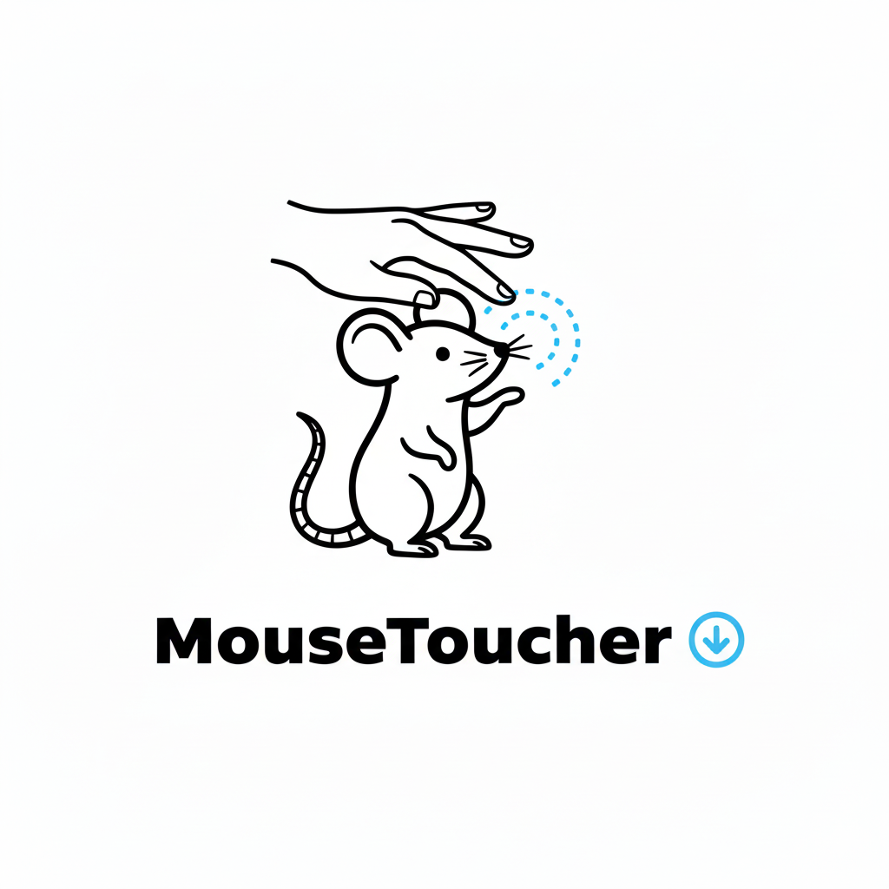

# Mouse Toucher

<p align="right"><a href="README.md">English</a> · 简体中文 · <a href="https://github.com/wudongchen/MouseToucher">GitHub</a></p>

<picture>
  <source media="(prefers-color-scheme: dark)" srcset="mousetoucher-dark.png">
  <source media="(prefers-color-scheme: light)" srcset="mousetoucher-light.png">
  
</picture>

**为苹果妙控鼠标提供触摸点击。**

Mouse Toucher 为妙控鼠标增加类似触控板的触摸点击功能。轻触鼠标表面即可点击，不必按下实体按键。

## 功能

- 轻触左侧执行左键点击
- 轻触右侧执行右键点击
- 支持单击和双击
- 过滤滑动动作，减少滑动时误触
- 可从菜单栏启用或停用触摸点击
- 可调节右键区域起始位置（40%–90%）
- 在菜单栏菜单中显示鼠标连接状态
- 蓝牙重连或 macOS 从睡眠唤醒后自动重新注册鼠标
- 支持 English 和简体中文菜单
- 完全本地运行，不联网、不收集数据

## 系统要求

- macOS 11.0（Big Sur）或更高版本
- 苹果妙控鼠标（第一代或第二代）
- 已通过蓝牙连接的妙控鼠标
- 辅助功能权限（用于发送模拟点击事件）

## 安装

### 从源码构建

```bash
git clone https://github.com/wudongchen/MouseToucher.git
cd MouseToucher
./build.sh
ditto build/MouseToucher.app /Applications/MouseToucher.app
open /Applications/MouseToucher.app
```

构建脚本会生成同时支持 Apple Silicon（arm64）和 Intel（x86_64）的通用应用，并使用稳定的指定要求进行 ad-hoc 签名，使本地重新构建后辅助功能授权尽量保持有效。

### 授予辅助功能权限

1. 打开 Mouse Toucher。
2. 在授权提示中点击 **打开系统设置**。
3. 前往 **隐私与安全性 → 辅助功能**，启用 Mouse Toucher。
4. 返回应用，程序会自动开始工作。

由于应用使用了苹果私有的 `MultitouchSupport` 框架，macOS 可能提示“应用已损坏”或“无法验证开发者”。首次打开时在 Finder 中右键应用并选择 **打开**；也可以在 **隐私与安全性** 中允许打开。

## 使用方法

点击菜单栏中的鼠标图标：

- **妙控鼠标：已连接/未连接** —— 只读连接状态
- **轻触点击** —— 开启或关闭触摸点击
- **右键区域** —— 设置右键区域的起始位置
- **辅助功能授权说明** —— 再次查看授权说明
- **语言** —— 在中文和英文之间切换
- **关于** —— 查看版本和框架信息

请保持轻触、快速。手指在表面移动会被识别为滑动，而不是点击。

## 故障排查

### 轻触没有反应

- 确认 **系统设置 → 隐私与安全性 → 辅助功能** 中已启用 Mouse Toucher。
- 确认 **系统设置 → 蓝牙** 中妙控鼠标显示为已连接。
- 打开菜单栏菜单，确认连接状态显示为 **已连接**。
- 如果刚刚断开蓝牙或 Mac 刚唤醒，请等待片刻，应用会自动重新注册设备。

### 调整右键区域

在菜单中使用 **右键区域**。高级用户也可以设置自定义值：

```bash
defaults write com.mousetoucher.app rightClickThreshold 0.75
```

数值会被限制在 `0.1`–`0.95` 范围内。

## 技术说明

Mouse Toucher 是一个原生 Swift 小程序，通过苹果私有的 `MultitouchSupport` 框架读取妙控鼠标触摸帧，再使用辅助功能 API 发送点击事件。私有框架不能用于 Mac App Store 应用，苹果未来也可能调整该 API。

应用面向妙控鼠标硬件，并会过滤内置触控板和外接妙控板，避免它们产生重复点击。

## 参与贡献

欢迎提交问题、设备兼容性反馈、文档改进和 Pull Request。反馈输入问题时，请附上 macOS 版本、鼠标型号和简短的复现步骤。

## 许可证

本项目采用 [MIT License](LICENSE) 开源。

## 致谢

维护者：[woodonchan](https://github.com/woodonchan)。

本项目使用了苹果 `MultitouchSupport` 框架相关的公开逆向工程资料。具体署名信息请参阅仓库历史记录和许可证文件。
